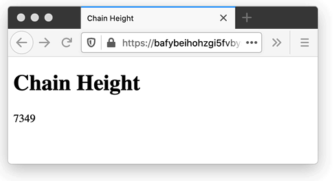

# Lotus JS Client


The Lotus JS Client is a collection of small JavaScript libraries that you can use to control the [Lotus implementation](https://github.com/filecoin-project/lotus) of [Filecoin](https://filecoin.io/) via its JSON-RPC API.

You can combine the libraries to build your own lightweight custom client that works in any JavaScript based environment!

Check out the [full documentation](https://filecoin-shipyard.github.io/js-lotus-client/), the [official tutorial](https://docs.filecoin.io/build/examples/network-inspector/overview/) as well as the [examples](https://github.com/filecoin-shipyard/js-lotus-client/tree/master/docs). Also check out the "Build" category in the [Filecoin Docs](https://docs.filecoin.io/build/) for full tutorials and other ways to build things that use Filecoin.

# Libraries

The following libraries are included:

* [@filecoin-shipyard/lotus-client-schema](https://www.npmjs.com/package/@filecoin-shipyard/lotus-client-schema) ([GitHub](https://github.com/filecoin-shipyard/js-lotus-client-schema))
* [@filecoin-shipyard/lotus-client-provider-browser](https://www.npmjs.com/package/@filecoin-shipyard/lotus-client-provider-browser) ([GitHub](https://github.com/filecoin-shipyard/js-lotus-client-provider-browser))
* [@filecoin-shipyard/lotus-client-provider-nodejs](https://www.npmjs.com/package/@filecoin-shipyard/lotus-client-provider-nodejs) ([GitHub](https://github.com/filecoin-shipyard/js-lotus-client-provider-nodejs))
* [@filecoin-shipyard/lotus-client-rpc](https://www.npmjs.com/package/@filecoin-shipyard/lotus-client-rpc) ([GitHub](https://github.com/filecoin-shipyard/js-lotus-client-rpc))

Check the [list of libraries](https://filecoin-shipyard.github.io/js-lotus-client/list-of-libraries.html) page in the documentation for more information!

# Usage

## On the Web

Let's try using it with JavaScript in a web page!

```html
<!DOCTYPE html>
<html lang="en">
  <head>
    <title>Chain Height</title>
  </head>
  <body>
    <h1>Chain Height</h1>
    <div id="chainHeight">Loading...</div>
    <script type="module">
      // Import ES modules from the npm packages via the unpkg.com CDN
      import { testnet } from 'https://unpkg.com/@filecoin-shipyard/lotus-client-schema?module'
      import { BrowserProvider } from 'https://unpkg.com/@filecoin-shipyard/lotus-client-provider-browser?module'
      import { LotusRPC } from 'https://unpkg.com/@filecoin-shipyard/lotus-client-rpc?module'

      // Public endpoint for demos
      const endpointUrl = 'wss://lotus.testground.ipfs.team/api/0/node/rpc/v0'
      // To connect to your local Lotus node, try using:
      // const endpointUrl = 'ws://localhost:1234/rpc/v0'

      // Instantiate a provider for the endpoint -- wraps the http and
      // websockets transports for use in a web browser
      const provider = new BrowserProvider(endpointUrl)

      // Create a client object with callable methods using a schema and
      // our provider. Calling methods on this object will send JSON-RPC
      // requests over the websocket.
      const client = new LotusRPC(provider, { schema: testnet.fullNode })

      // Using the client and the "ChainHead" method, every second,
      // retrieve the chain height and update the web page
      async function run () {
        const chainHeightEl = document.getElementById('chainHeight')
        while (true) {
          const { Height: height } = await client.chainHead()
          chainHeightEl.textContent = height
          await new Promise(resolve => { setTimeout(resolve, 1000) })
        }
      }
      run()
    </script>
  </body>
</html>
```

[See it running here!](https://bafybeihohzgi5fvbysfatkjvk4b5haussxiogyrml4p2gto2dn4cpziox4.ipfs.dweb.link/)

It will look like this: (5x speed)



## From Node.js

Coming soon... ([gist with quick example](https://gist.github.com/jimpick/0b00bcd0a618238f3fe3ff89f9ac800c))

## Full Tutorial

Check out the tutorial on docs.filecoin.io:

* [Filecoin Network Inspector Tutorial](https://docs.filecoin.io/build/examples/network-inspector/overview/)

## More examples

Here are some more examples to get started:

* [ObservableHQ Notebooks](https://observablehq.com/collection/@jimpick/lotus-js-client) - Observable Notebooks are a great way to learn about and try out the API.
  * Here's the [simplest example](https://observablehq.com/@jimpick/lotus-js-client?collection=@jimpick/lotus-js-client), which connects to the "local net" and gets the chain head
  * A [more complex example](https://observablehq.com/@jimpick/lotus-js-client-testnet?collection=@jimpick/lotus-js-client) connects to the Testnet and gets a list of miners and displays them on a 3D map using Deck.gl
  * And here's an example of how to [query an ask](https://observablehq.com/@jimpick/lotus-js-client-testnet-querying-ask?collection=@jimpick/lotus-js-client) from a miner on the Testnet
  * ... more to come. Submissions welcome!

We also built a workshop for the [Ready Layer One](https://www.youtube.com/channel/UC-JxjKyX63VGkRM-8jziK8Q/videos) conference. We have been updating it since the conference and it contains code that shows how to store and retrieve files using a Lotus node (connected to our demo "local net").

  * GitHub: [filecoin-shipyard/js-lotus-client-workshop](https://github.com/filecoin-shipyard/js-lotus-client-workshop)
  * Glitch: [Try it here or remix it!](https://glitch.com/edit/#!/js-lotus-client-workshop)

## Workshop Videos

  * 2020.05.31: [30 minute Workshop](https://bafybeihm6irnryqsgrqbvhth7ghewrezokkpr4dajbai642mkhnk3ytpqy.ipfs.dweb.link/filecoin.mp4) from [Distributed Camp 2020](https://distributed.camp/projects/ipfs/)
  * 2020.05.08: [5 minute Lightning Talk Demo](https://www.youtube.com/watch?v=hCNr5Sj323k&list=PLuhRWgmPaHtTvsxuZ9T-tMlu_v0lja6v5) from [IPFS Pinning Summit](https://ipfspinningsummit.com/)

## Documentation

* [Lotus JS Client Documentation](https://filecoin-shipyard.github.io/js-lotus-client/)

## Contributing

Feel free to join in. All welcome. [Open an issue](https://github.com/filecoin-shipyard/js-lotus-client/issues)!

Conversations and questions about the Lotus JS Client libraries are welcome in the `#fil-storage-dev` channel in the Filecoin Commmunity Slack. Find out how to sign up over at the
[Filecoin Community](https://filecoin.io/#community) page.

## License

Dual-licensed under [MIT](https://github.com/filecoin-project/lotus/blob/master/LICENSE-MIT) + [Apache 2.0](https://github.com/filecoin-project/lotus/blob/master/LICENSE-APACHE)
